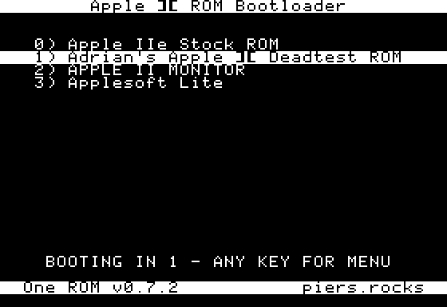

# Apple II RBCP Bootloader

Pick which ROM image an Apple II boots, from those held on a One ROM, or other RBCP capable ROM emulator, fitted in place of the ROM the machine starts from: the F8 socket on a II or II+, the EF socket on a IIe.

| Build | Machine | Socket | Image |
|-------|---------|--------|-------|
| `apple2_boot_f8.bin` | II, II+ | F8, $F800-$FFFF | 2KB |
| `apple2_boot_ef.bin` | IIe | EF, $E000-$FFFF | 8KB |


The 8KB build has run on an Apple IIe. **The 2KB build is untested on hardware.**

## What it does

It beeps, lists the images, and counts down before booting whichever one you chose last time — or image 0, the first time.



Any key stops the countdown and does its own job as well:

- **0-9** — pick one of the first ten images
- **RETURN** — boot the highlighted image
- **CURSOR UP/DOWN** — move, on a IIe
- **CURSOR LEFT/RIGHT** — move, on any Apple II

Sixteen images fit on screen, and whatever you boot is remembered for next time.

If the device has an RGB LED, it cycles through colours while the menu is up, then breathes one colour per image once you boot. That colour stays on afterwards, so you can see which image is running. If the device has a pipe (USB logging on One ROM), it also logs two lines, the second naming the slot it is about to boot.

If it hits an error it cannot recover from, it says so on screen and stops.

**It needs working RAM** — the first 4K, the stack and zero page — so a machine too broken for that never gets as far as the menu. If yours does not boot, try the [Apple II Dead Test ROM](https://github.com/misterblack1/appleII_deadtest) on its own first.

## Building

```bash
make
```

Needs [cc65](https://cc65.github.io/) for `ca65`, `ld65` and `ar65` — `brew install cc65` or `apt install cc65`.

| Option | Default | What it does |
|--------|---------|--------------|
| `COUNTDOWN` | 3 | Seconds before it boots on its own. |
| `NV_FATAL` | unset | Stop instead of booting when the device will not remember the choice. 8KB build only. |

```bash
make COUNTDOWN=10 NV_FATAL=1
```

## Programming it

The bootloader goes in first, then the images you want to choose between. For a IIe:

```bash
onerom program --plugin usb --plugin host-control \
    --slot file=build/apple2_boot_ef.bin,type=2764 \
    --slot file=342-0134-A.bin,type=2764,label="Stock ROM" \
    --slot file=apple2dead.bin,type=2764,size=dup,label="Dead Test"
```

Dead test is a 2KB image, and `size=dup` fills the 8KB socket with four copies of it, so a IIe can run it. On a II or II+ use `apple2_boot_f8.bin` and 2KB images in the F8 socket, and drop `size=dup` — those already fill it.

`342-0134-A.bin` is the stock EF ROM from a standard Apple IIe. See [Testing without hardware](#testing-without-hardware) for sourcing Apple II ROM files. `apple2dead.bin` is the 2KB image from the [dead test releases](https://github.com/misterblack1/appleII_deadtest/releases) — `file=` takes a URL as readily as a path.

The menu shows the `label` you give each slot, so use names you will recognise on screen. Only the first 30 characters fit.

Fit it in the socket and power on: a beep, then the list.

## Testing without hardware

[`test/`](test/README.md) runs either build on an emulated Apple II under MAME, against a fake RBCP device, and prints what the machine displays.

```bash
make test    ROMS=/path/to/apple2/roms
make test-ef ROMS=/path/to/apple2/roms
```

`ROMS` is a directory holding the machine's own ROM files, which are Apple's and are not in the repository. [test/](test/README.md#where-the-rom-files-come-from) lists the files each machine needs, where to download them, and what to name them. Put them anywhere you like and give that directory's path. Without them the test says which files are missing and stops, rather than inventing them and reporting a pass.
